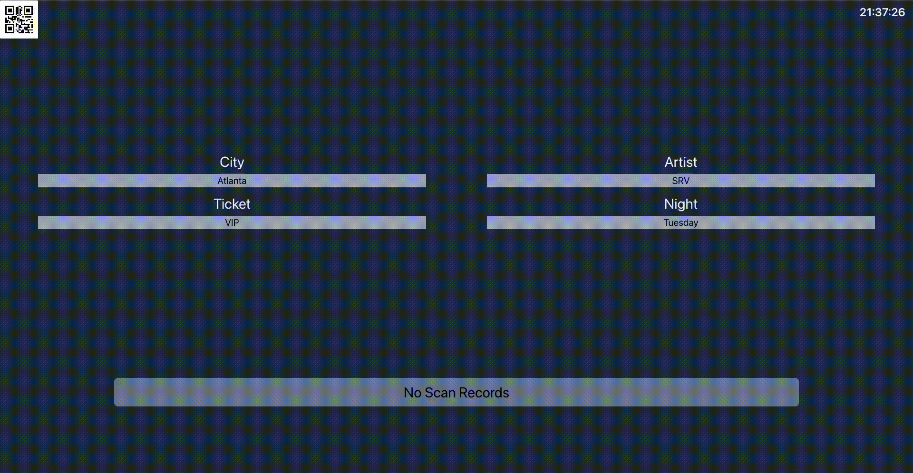

<div align="center">
<h1 style="text-align: center;">Solid Scan</h1>
  

[](https://github.com/jeremiah-carlson/solid-scan/actions/workflows/deploy-gh-pages.yaml)
[](https://github.com/jeremiah-carlson/solid-scan/actions/workflows/azure-static-web-apps-salmon-rock-0523f670f.yml)


<br>



</div>

# Summary
Solid Scan is designed to be a simple and easily configurable web based QR code logger. It achieves this through he use of a single config file, allowing the user to predefine delimiters, value labels, selectable categories, backend-service, ect.


## Sample Config File
```javascript
const conf = {
    output: {// Backend Service
        origin: origin,
        path: 'scan/output/',
    },
    delims: {// Allow you to adjust for pre-defined QR codes
        settings: '@@',
        mainInput: '-'
    },
    categories: [// These catagories will be sent with each request and are configurable within the UI
        {
            name: 'city',
            options: ['Austin','Atlanta','Tennessee', 'Chicago','Baltimore','New Orleans','Boulder']
        },
        {
            name: 'artist',
            options: ['Lightning Hopkins', 'SRV', 'Eric Clapton', 'Muddy Waters', 'Lemon Jefferson', 'Buddy Guy', 'John Hurt']
        },
        {
            name: 'ticket',
            options: ['General','Backstage','VIP', 'Staff']
        },
        {
            name: 'night',
            options: ['Sunday', 'Monday', 'Tuesday', 'Wednesday', 'Thursday', 'Friday', 'Saturday']
        },
    ],
    input: {
        labels: ['ticketNo', 'section', 'seat'],// These represent the keys for the associated QR values
        constants: {
            'company': 'Ticket CO.',// Constants will send with every request and will not be configurable within the UI
        },
    },
};

export default conf;
```
